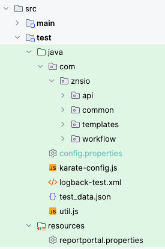

Back to main [README](./../README.md)

-----

# Project specific customisations

## Configuration
Follow this  for your test implementation.

You will need to update the following files from `./src/test`:

### Update [config.properties](./../src/test/java/config.properties)

### Update Test Data file

By default, kendo looks for the test data file here - `./src/test/java/test_data.json`.
You can override it by providing the path to this file in config.properties with the name - `TEST_DATA_FILE_NAME` or providing this as an environment variable

Specify the test-data for each environment that you are going to run the test. The structure is:

    ```
    {
      "local": {
        "env": {
          "baseUrl": "https://github.com",
        }
      },
      "prod": {
        "env": {
          "baseUrl": "https://github.com",
        }
      }
    }
    ```

For each environment, you can specify user-specific data as well. Ex:

    ```
    {
      "local": {
        "env": {
          "baseUrl": "https://github.com",
        },
        "anand": {
          "city": "Pune" 
        },
        "naresh": {
          "city": "Mumbai"
        }
      },
      "prod": {
        "env": {
          "baseUrl": "https://github.com",
        }
        "anand": {
          "city": "Mumbai" 
        },
        "naresh": {
          "city": "Pune"
        }
      }
    }
    ```

### karate-config.js

The default [karate-config.js](./src/test/java/karate-config.js) is provided. This file will automatically load the test-data file. You can add your custom configuration between the sections:

    /* Begin update of configuration based on project needs */

    ...
    ...
    ...

    /* End update of configuration based on project needs */

### Update [reportportal.properties](./ReportPortal.md)

-----

Back to main [README](./../README.md)
